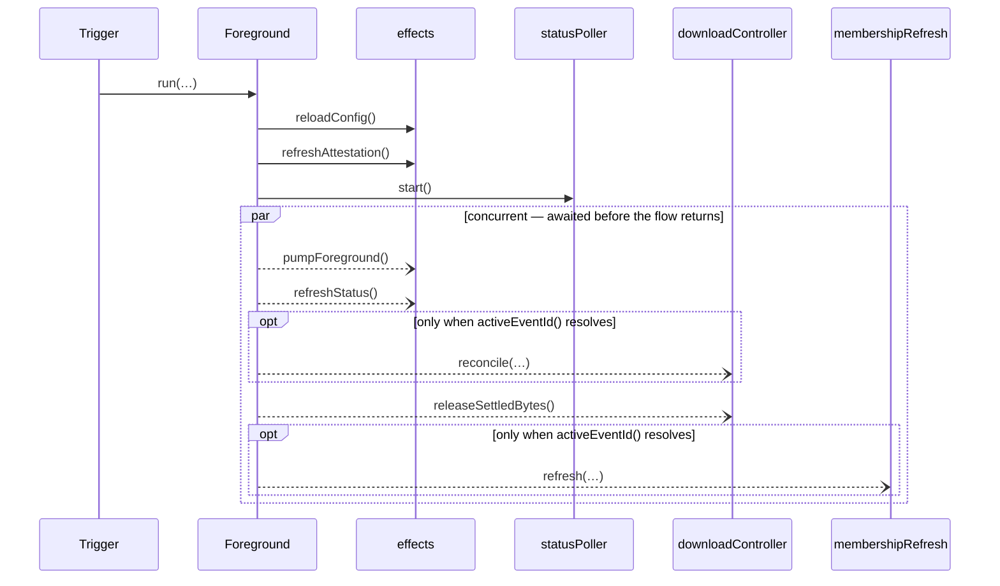

# Flow — `Foreground`

Generated by `./gradlew architectureDiagrams` from `domain/flow/src/commonMain/kotlin/app/snapsync/flow/Foreground.kt`.
Do not edit — the `:tools:diagrams` freshness test fails on drift; regenerate instead.

Transcribed against the closed flow grammar; a construct outside it FAILS generation
(the hard gate, armed at the migration finale — an untranscribable flow is a law
violation, spec `architecture-diagrams`). Bare calls target the flow's injected
`compose/`-built effect lambdas, rendered as `effects`; `log.*` lines are diagnostics
and omitted. Async arrows are concurrent branches, awaited by the enclosing flow.

## `run` — the flow command

