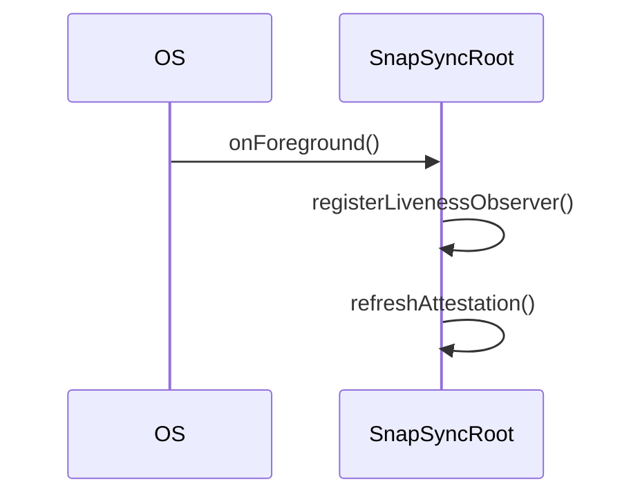

# Flow — `onForeground` (current-state paper transcription)

Generated by `./gradlew architectureDiagrams` from `app/ios/src/iosMain/kotlin/app/snapsync/ios/SnapSyncRoot.kt`.
Do not edit — the `:tools:diagrams` freshness test fails on drift; regenerate instead.

Current-state edition: the closed transcriber grammar (straight-line feature calls,
`par` fan-out, `when` over a feature-returned sealed result, a single leading guard
clause) and its generation-failure gate arm only when the target `flow/` zone exists;
until then each construct outside the grammar is a burn-down item below, not a build
failure. `log.*` statements are diagnostics, not flow, and are omitted from both lists.

## Not transcribable (burn-down)

- line 550 — `if` conditional: `if (isForging) {`
- line 554 — bare property read (lazy-init touch): `host`
- line 561 — `if` conditional: `if (useAppDrivenUpload) urlSessionUpload.onForeground()`
- line 564 — `scope.launch` body: `scope.launch { refreshStatusSources() }`
- line 567 — `scope.launch` body: `scope.launch { config.config.value?.eventId?.let { downloadController.reconcile(it) } }`
- line 569 — `scope.launch` body: `scope.launch { config.config.value?.eventId?.let { fetchAndStoreName(it) } }`
