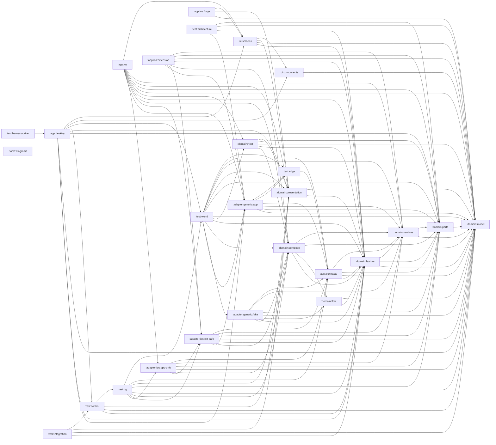

# Module dependency graph

Generated by `./gradlew architectureDiagrams` from the Gradle project model: every
`project(...)` dependency declared by any BUILD configuration of any module,
deduplicated. Report-aggregation configurations (`kover*`) are excluded: they merge
coverage data rather than putting classes on a classpath, so an edge through one is not
an architectural dependency and would render backwards here.
Do not edit — the `:tools:diagrams` freshness test fails on drift; regenerate instead.

