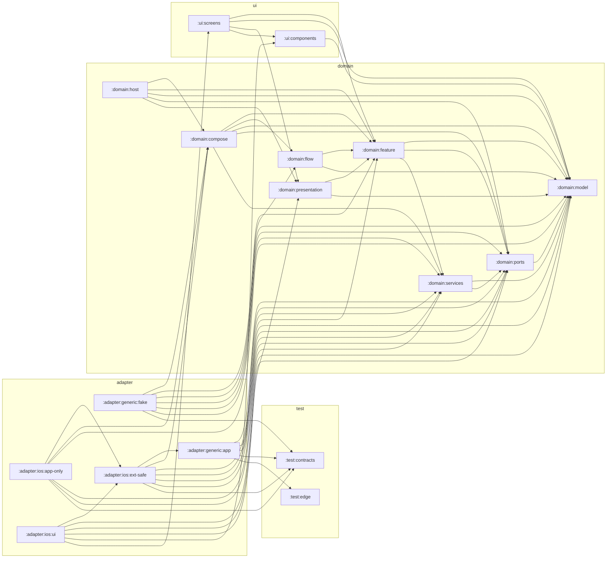

# Zone / feature graph

Generated by `./gradlew architectureDiagrams` from the `project(...)` declarations in
every `build.gradle.kts` under `adapter/`, `domain/` and `ui/` (a directory walk — the
scope is derived, so this graph tracks restructures automatically as modules move). Do
not edit — the `:tools:diagrams` freshness test fails on drift; regenerate instead.

